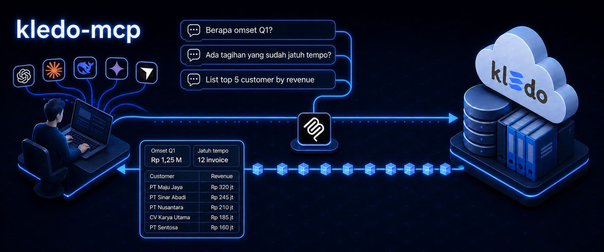

<p align="center">
  
</p>

<p align="center">
  <strong>English</strong> | <a href="README.id.md">Bahasa Indonesia</a>
</p>

# Kledo MCP

> [!IMPORTANT]
> **This is not an official Kledo MCP server.** I maintain this independent
> open-source project as a Kledo user. It is not affiliated with, sponsored by,
> endorsed by, or supported by Kledo.
>
> I built it because I needed a narrow, read-only bridge between Kledo and
> MCP-capable AI agents or harnesses such as ChatGPT, Claude, Hermes, Codex,
> Cursor, and other compatible clients.
>
> I maintain the repository with substantial help from AI coding agents. Human
> maintainers remain responsible for scope, security, review, and releases.

Kledo MCP is a minimal, read-only
[Model Context Protocol](https://modelcontextprotocol.io/) server for querying
one caller-configured Kledo tenant. I expose exactly three bounded tools over
stdio and keep raw endpoints, credentials, and pagination mechanics out of the
AI model's interface.

**Status:** `0.1.x` preview. I am intentionally keeping the interface small
while response shapes and report behavior are verified.

## Current MCP architecture

> [!NOTE]
> I develop and test this server against the current MCP protocol revision,
> [`2026-07-28`](https://modelcontextprotocol.io/specification/2026-07-28),
> using the MCP 2.x server architecture. The official versioning guide marked
> this as the current revision when I last checked on 2026-08-27.
>
> Older MCP guides for `2025-11-25` and earlier use a handshake-based protocol
> architecture, so their initialization flow and server examples do not map
> directly to this repository. I retain tested compatibility with
> `2025-06-18` for clients that still negotiate it, but new development follows
> `2026-07-28`.

See the official [MCP versioning guide](https://modelcontextprotocol.io/docs/2026-07-28/learn/versioning)
and this project's [architecture guide](docs/architecture.md) for details.

## Quick setup

Requirements:

- Node.js 22.19 or later
- npm
- access to a Kledo tenant's Open API page

```bash
git clone https://github.com/kevzakaria/kledo-mcp.git
cd kledo-mcp
npm ci
npm run setup
```

The setup wizard builds the server, guides you to **Settings > Integration >
Open API**, accepts the token through hidden terminal input, writes a
gitignored `.env` with owner-only permissions, and validates the local
configuration without making a Kledo API request.

Then add the generated command to your MCP client. Copy-ready examples are
available for [Hermes, Codex, Claude Desktop, and Cursor](docs/client-setup.md).

### Install with your AI agent

Copy this prompt into the coding agent or local AI harness you trust:

```text
Install and configure kledo-mcp from https://github.com/kevzakaria/kledo-mcp.

1. Clone the repository and verify that Node.js 22.19 or later and npm are available.
2. Run npm ci.
3. Run npm run setup. Pause for me when the wizard needs the Kledo API URL or token so I can enter them directly through the hidden terminal input.
4. Never ask me to paste a token into chat, source code, command history, logs, or a committed file.
5. Read docs/client-setup.md and configure my chosen MCP client using environment variables or my preferred secret manager.
6. Run npm run config:check and npm test, then verify that the server advertises exactly kledo_query, kledo_get, and kledo_report.
7. Do not add tools, call Kledo write endpoints, change the read-only scope, expose secrets, or commit .env.
8. Tell me what you changed, which checks passed, and the exact command my MCP client will run.
```

Prefer another secret manager or a manually managed environment? Read
[configuration and secret handling](docs/configuration.md). The server only
reads `KLEDO_API_BASE_URL` and `KLEDO_API_TOKEN` from its process environment.

## Three read-only tools

| Tool | Purpose |
| --- | --- |
| `kledo_query` | Search or page through an allowlisted Kledo entity |
| `kledo_get` | Retrieve one normalized record and bounded relationships |
| `kledo_report` | Run an allowlisted native Kledo report |

I do not expose tools that create or modify records, switch tenants during a
call, send messages, export files, or issue arbitrary HTTP requests. Read the
[tool reference](docs/tool-reference.md) for supported entities, reports,
examples, and current implementation status.

## Documentation

| Guide | Contents |
| --- | --- |
| [Configuration](docs/configuration.md) | Wizard, manual setup, secret handling, and multiple tenants |
| [Client setup](docs/client-setup.md) | Hermes, Codex, Claude Desktop, Cursor, and MCP Inspector |
| [Tool reference](docs/tool-reference.md) | Tool contracts, entity catalog, reports, and example questions |
| [Architecture](docs/architecture.md) | Data flow, protocol target, boundaries, transport behavior, and safe failures |
| [Security policy](SECURITY.md) | Vulnerability reporting and credential safety |

## Issues and contributions

I welcome bug reports and feature proposals through the
[GitHub issue chooser](https://github.com/kevzakaria/kledo-mcp/issues/new/choose).
Blank issues are disabled so reports remain actionable.

Issues created by AI agents are welcome. They must identify the agent or
harness, name a human reviewer when available, distinguish verified facts from
proposals, include sanitized evidence, and define testable acceptance criteria.
Never include tokens, tenant URLs, customer records, real invoice numbers, raw
production responses, local paths, or private integration identifiers.

Feature requests should begin with a user or company question that cannot be
answered safely today. Please do not request a new tool merely because another
Kledo endpoint exists. Read [CONTRIBUTING.md](CONTRIBUTING.md) before
implementing a change, and report vulnerabilities privately through
[SECURITY.md](SECURITY.md).

## License and trademarks

Copyright 2026 Kledo MCP contributors. Licensed under the
[Apache License 2.0](LICENSE).

Kledo and the displayed AI client names and logos are trademarks of their
respective owners. I use them only to identify interoperability or potential
client compatibility. Their appearance does not imply affiliation,
certification, sponsorship, or endorsement.
