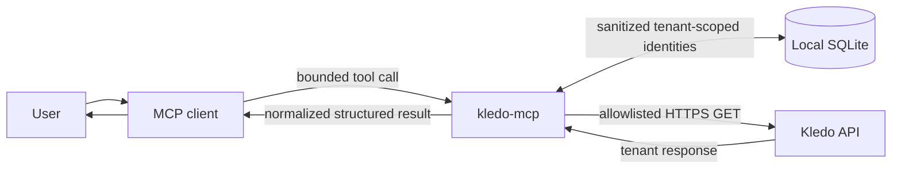
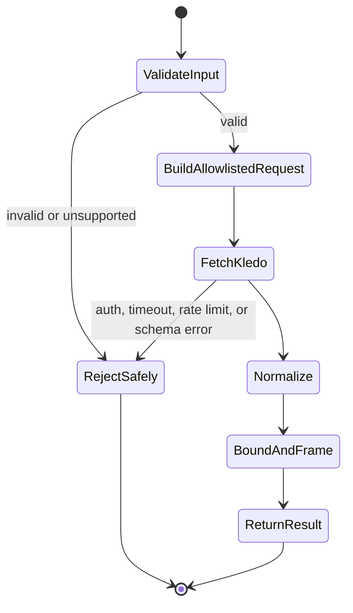

# Architecture

Kledo MCP is one local stdio process connected to one operator-configured Kledo
tenant. The design keeps credentials and upstream routing outside all tool
inputs.

## Data flow





## Product boundaries

The server:

- connects one process to one configured tenant;
- uses allowlisted read-only Kledo GET endpoints;
- normalizes identifiers, money, parties, payment state, pagination, freshness,
  and completeness for AI callers;
- publishes machine-readable `structuredContent` and a compact text mirror; and
- treats every Kledo-originated string as untrusted data.

The server does not:

- create, update, or delete Kledo records;
- authenticate Kledo users or manage tokens;
- accept arbitrary URLs, paths, HTTP methods, or headers from tool callers;
- switch tenants during a tool call;
- send email or messages;
- export files; or
- expose admin, webhook, SQL, debug, or cache-control tools.

## Protocol and transport

The native server targets the current MCP revision,
[`2026-07-28`](https://modelcontextprotocol.io/specification/2026-07-28), with
the official TypeScript SDK `2.0.0`. In this architecture, every request
declares its protocol version and `server/discover` exposes the server's
supported versions and capabilities. Revisions `2025-11-25` and earlier use a
handshake-based architecture. The stdio entry point retains tested support for
clients that negotiate `2025-06-18`, but new development follows `2026-07-28`.

Stdout is reserved for MCP JSON-RPC. Diagnostics use stderr. Inbound frames over
1 MiB are rejected. Tool inputs are bounded below that limit so protocol errors
have room to report safely.

Results that fit normally include both structured JSON and a text mirror. For a
multi-mebibyte result, the text mirror becomes a compact structural summary
while the complete bounded payload remains in `structuredContent`. A result
that cannot fit the MCP frame fails safely.

## Data representation

- Kledo IDs are decimal strings.
- Monetary amounts are decimal strings.
- Currency is populated only when Kledo supplies explicit currency metadata.
- Numeric JSON tokens are parsed from source text to avoid silent decimal
  rounding.
- Unsafe integer tokens fail instead of being rounded.
- `pageInfo.hasMore` and `meta.complete` distinguish a page from a complete
  result.
- Continuation cursors are opaque, signed, and bound to the original query.
- Sales and Purchase Invoice document lineage uses an explicit transaction-type
  registry. `relations[]` supplies the complete typed predecessor set and
  `parent_tran` identifies the immediate predecessor. Sales Invoice payment
  facts come from its transactions endpoint; Purchase Invoice payment facts are
  embedded in the detail response because no purchase equivalent endpoint was
  found. Payment relation and transaction halves must agree before a joined
  event is returned.
- Native report rows remain Kledo-shaped when their schema is undocumented,
  except for explicitly validated adapters such as `sales_by_person`,
  `sales_order_kpi`, `dormant_customers`, `receivable_by_invoice`, and
  `item_price_analysis`.
- `sales_by_person` validates Kledo's current flat response, keeps nested user
  PII out of normalized output, and applies the signed cursor locally because
  the upstream report does not return pagination metadata.
- `sales_order_kpi` consumes the complete bounded Sales Order pageset and sums
  Kledo's page-level `grand_subtotal` fields with exact decimal arithmetic.
  Every row is checked against the requested document type, booked status set,
  transaction-date period, and optional salesperson before the KPI is returned.
- `dormant_customers` consumes complete bounded historical and recent
  `incomePerCustomer` pagesets, subtracts recent customer IDs, ranks candidates
  by historical income, and applies a signed cursor locally. It explicitly
  reports the limits of the inference instead of claiming an exact last sale or
  definitive churn.
- `receivable_by_invoice` pages Kledo's authoritative Aged Receivable customer
  summary, then completely consumes the invoice drill-down for each customer on
  that page. Customer totals are checked across both sources, `memo` is exposed
  as the Web UI project/reference concept, and a remaining customer cursor keeps
  the result explicitly incomplete.
- `item_price_analysis` resolves exactly one active product before fetching
  product detail, latest sell and buy prices, Purchase Invoice product rows, and
  period profitability. Multiple name matches fail rather than selecting the
  first row. Catalog settings, transaction prices, and period HPP remain
  separate fields with source provenance.

## Tenant identity catalog

Exact salesperson name resolution uses a bounded in-memory cache backed by a
local SQLite catalog. The same catalog stores sanitized contact roles, contact
types and groups, products and categories, warehouses, units, and finance
accounts under separate entity types. A fresh salesperson match can survive an
MCP process restart; a missing or stale salesperson snapshot is refreshed from
Kledo's `/users` endpoint before the native report is called with `sales_id`.

The explicit `npm run warmup` adapter invokes the same internal refresh path
before the first MCP query. It validates every allowlisted master source,
walks paginated catalogs, derives contact-role snapshots from `type_ids`,
flattens the product-category tree, and atomically replaces every sanitized
tenant snapshot. It returns only counts and a timestamp. Warm-up is a local CLI
operation, not a fourth public MCP tool.

Rows are scoped by a one-way digest of the configured API origin and bearer
token. The stored payload is limited to entity type, external ID, display and
normalized names, active state, and timestamps. Tokens, email addresses, raw
responses, and accounting transactions are excluded. SQLite failures never
select an identity from another scope: the gateway resolves from Kledo and
returns a sanitized warning.

## Safe failure behavior

Authorization, validation, timeout, rate-limit, availability, pagination, and
schema failures return bounded tool errors without credentials or raw upstream
bodies. Unsupported options fail before Kledo is called.

Kledo-originated text is always data. Names, memos, product descriptions, and
other fields cannot change server behavior or provide instructions to the MCP
host.

## Concurrency and upstream safety

The HTTP gateway uses bounded response sizes, request timeouts, limited retry
attempts, capped retry waits, and FIFO concurrency control. It follows only the
configured HTTPS origin and rejects unsafe redirects.

Financial statements use Kledo's native report endpoints. The server does not
present a partial first page of transactions as an authoritative total.

## Verification

Normal development uses synthetic or irreversibly sanitized fixtures. It does
not need a live Kledo credential.

```bash
npm run typecheck
npm test
npm run build
npm pack --dry-run
```

For live discovery, use the private setup in [client setup](client-setup.md).
Listing tools does not call Kledo. Real tool calls must remain authorized and
private.

See [SECURITY.md](../SECURITY.md) for the threat model and vulnerability
reporting process, and [CONTRIBUTING.md](../CONTRIBUTING.md) for implementation
requirements.
