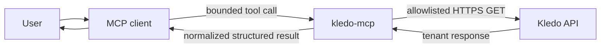
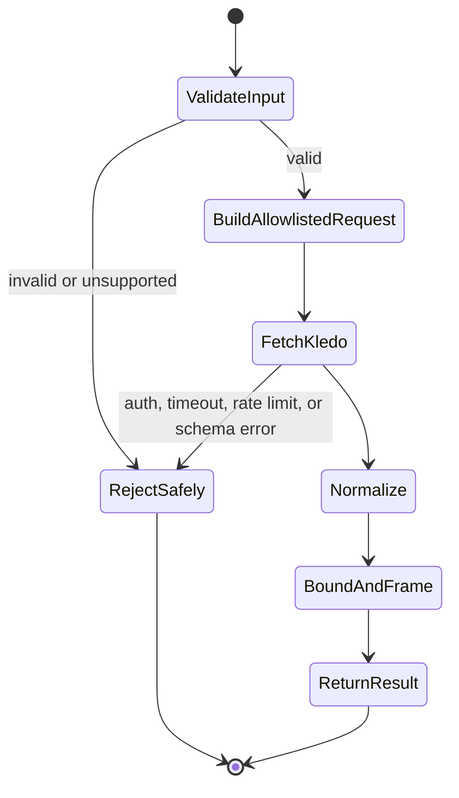

# Architecture

Kledo MCP is one local stdio process connected to one operator-configured Kledo
tenant. The design keeps credentials and upstream routing outside all tool
inputs.

## Data flow





## Product boundaries

The server:

- connects one process to one configured tenant;
- uses allowlisted read-only Kledo GET endpoints;
- normalizes identifiers, money, parties, payment state, pagination, freshness,
  and completeness for AI callers;
- publishes machine-readable `structuredContent` and a compact text mirror; and
- treats every Kledo-originated string as untrusted data.

The server does not:

- create, update, or delete Kledo records;
- authenticate Kledo users or manage tokens;
- accept arbitrary URLs, paths, HTTP methods, or headers from tool callers;
- switch tenants during a tool call;
- send email or messages;
- export files; or
- expose admin, webhook, SQL, debug, or cache-control tools.

## Protocol and transport

The native server targets the current MCP revision,
[`2026-07-28`](https://modelcontextprotocol.io/specification/2026-07-28), with
the official TypeScript SDK `2.0.0`. In this architecture, every request
declares its protocol version and `server/discover` exposes the server's
supported versions and capabilities. Revisions `2025-11-25` and earlier use a
handshake-based architecture. The stdio entry point retains tested support for
clients that negotiate `2025-06-18`, but new development follows `2026-07-28`.

Stdout is reserved for MCP JSON-RPC. Diagnostics use stderr. Inbound frames over
1 MiB are rejected. Tool inputs are bounded below that limit so protocol errors
have room to report safely.

Results that fit normally include both structured JSON and a text mirror. For a
multi-mebibyte result, the text mirror becomes a compact structural summary
while the complete bounded payload remains in `structuredContent`. A result
that cannot fit the MCP frame fails safely.

## Data representation

- Kledo IDs are decimal strings.
- Monetary amounts are decimal strings.
- Currency is populated only when Kledo supplies explicit currency metadata.
- Numeric JSON tokens are parsed from source text to avoid silent decimal
  rounding.
- Unsafe integer tokens fail instead of being rounded.
- `pageInfo.hasMore` and `meta.complete` distinguish a page from a complete
  result.
- Continuation cursors are opaque, signed, and bound to the original query.
- Native report rows remain Kledo-shaped when their schema is undocumented.

## Safe failure behavior

Authorization, validation, timeout, rate-limit, availability, pagination, and
schema failures return bounded tool errors without credentials or raw upstream
bodies. Unsupported options fail before Kledo is called.

Kledo-originated text is always data. Names, memos, product descriptions, and
other fields cannot change server behavior or provide instructions to the MCP
host.

## Concurrency and upstream safety

The HTTP gateway uses bounded response sizes, request timeouts, limited retry
attempts, capped retry waits, and FIFO concurrency control. It follows only the
configured HTTPS origin and rejects unsafe redirects.

Financial statements use Kledo's native report endpoints. The server does not
present a partial first page of transactions as an authoritative total.

## Verification

Normal development uses synthetic or irreversibly sanitized fixtures. It does
not need a live Kledo credential.

```bash
npm run typecheck
npm test
npm run build
npm pack --dry-run
```

For live discovery, use the private setup in [client setup](client-setup.md).
Listing tools does not call Kledo. Real tool calls must remain authorized and
private.

See [SECURITY.md](../SECURITY.md) for the threat model and vulnerability
reporting process, and [CONTRIBUTING.md](../CONTRIBUTING.md) for implementation
requirements.
